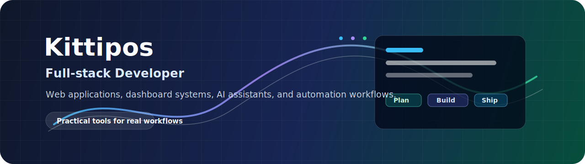
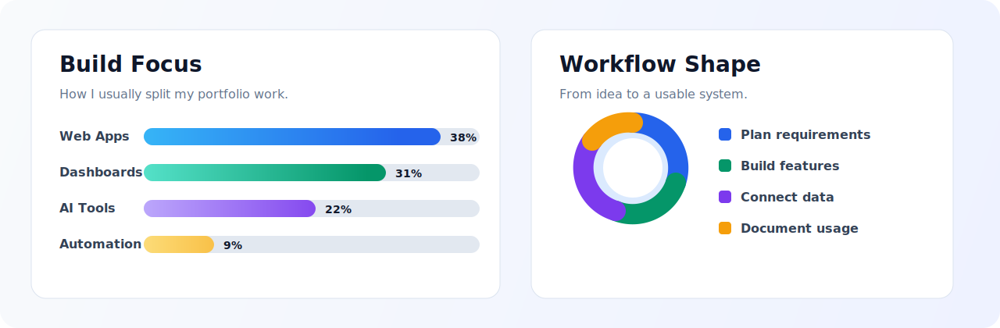

<div align="center">
  

  <h1>Hi, I'm Kittipos</h1>

  <p>
    Full-stack developer focused on practical web applications, dashboard systems,
    AI-assisted tools, and automation workflows.
  </p>

  <p>
    <a href="https://github.com/ktp-sun">
      
    </a>
  </p>
</div>

---

## What I Build

<table>
  <tr>
    <td width="33%" valign="top">
      <h3>Web Applications</h3>
      <p>Authentication, dashboards, admin panels, role-based access, and business CRUD workflows.</p>
    </td>
    <td width="33%" valign="top">
      <h3>AI + Data Systems</h3>
      <p>RAG apps, vector search, FastAPI services, local LLM tooling, and database-backed chat history.</p>
    </td>
    <td width="33%" valign="top">
      <h3>Automation Workflows</h3>
      <p>API integrations, Telegram workflows, structured data pipelines, and operational process automation.</p>
    </td>
  </tr>
</table>

## Work Snapshot

<div align="center">
  
</div>

## Tech Stack

<div align="center">


</div>

## Current Focus

```text
frontend      React, Vite, responsive dashboard interfaces
backend       Node.js, Express, FastAPI, ASP.NET Core
database      MySQL, MongoDB, schema design, sample data
ai workflow   RAG, FAISS, local LLM tools, automation flows
```

## Contact

- GitHub: [@ktp-sun](https://github.com/ktp-sun)
