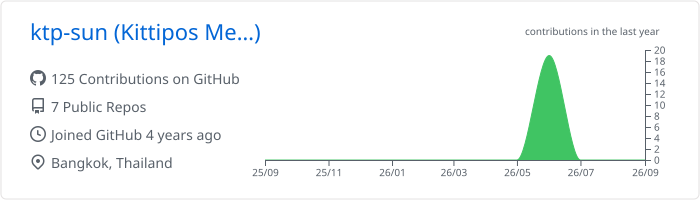
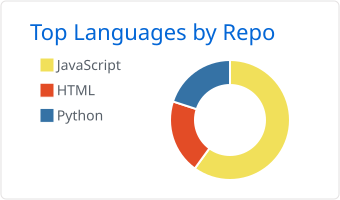
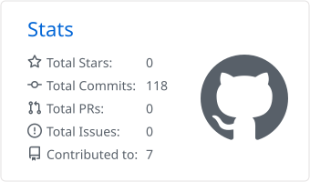

<div align="center">
  

  <h1>Hi, I’m Kittipos Meksumpun (Sun)</h1>

  <p>
    <strong>Backend Developer · AI Engineer · Full-Stack Builder</strong><br />
    I turn practical requirements into reliable web systems, intelligent tools, and automation workflows.
  </p>

  <p>
    <a href="https://kittipos-portfolio-git.vercel.app"></a>
    <a href="https://github.com/ktp-sun"></a>
  </p>
</div>

---

## What I build

<table>
  <tr>
    <td width="33%" valign="top">
      <h3>⚡ Full-Stack Systems</h3>
      <p>Role-aware products, dashboards, admin panels, APIs, and business workflows that stay clear as they grow.</p>
    </td>
    <td width="33%" valign="top">
      <h3>✦ AI Engineering</h3>
      <p>RAG applications, vector search, local LLM tooling, and automation that turns useful data into practical actions.</p>
    </td>
    <td width="33%" valign="top">
      <h3>⌁ Secure Foundations</h3>
      <p>Backend services with authentication, sensible data boundaries, and a security-minded approach to reliability.</p>
    </td>
  </tr>
</table>

## Tech stack

<div align="center">

### Frontend


### Backend, data &amp; AI


</div>

## GitHub snapshot

<div align="center">
  
  <br />
  
  
</div>

## How I work

```text
understand   clarify the real outcome before choosing the implementation
prototype    build a small working slice and learn from feedback
iterate      refine UX, performance, and edge cases instead of stopping at the first draft
ship         keep the result documented, testable, and easy to maintain
```

## Contact

<div align="center">
  <p>Open to conversations about backend systems, AI-enabled products, and cooperative education opportunities.</p>
  <p>📍 Pathum Thani, Thailand</p>
  <a href="https://kittipos-portfolio-git.vercel.app">View my portfolio →</a>
</div>
